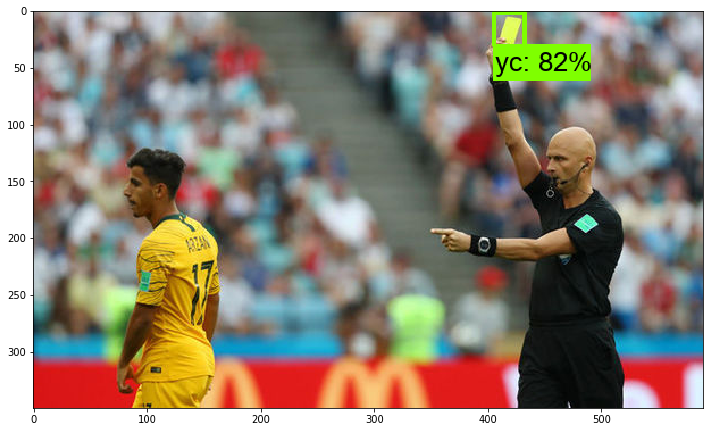
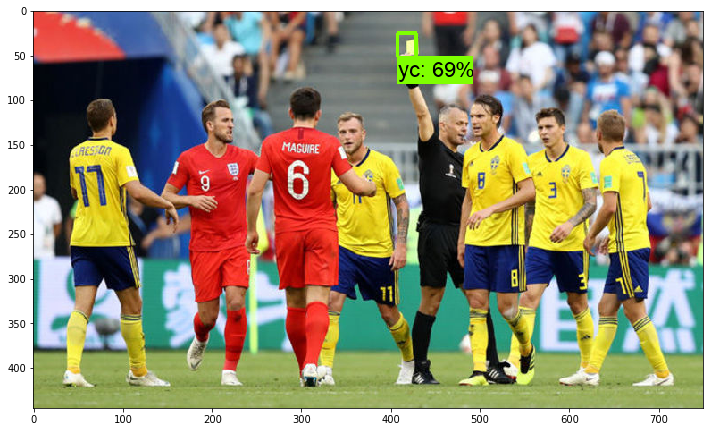
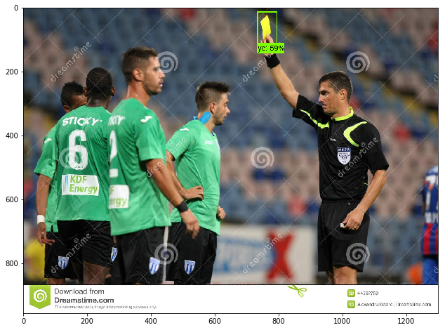
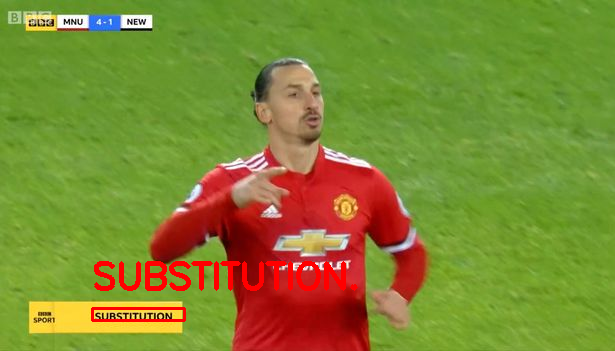

# Video-Summarization-for-Football
Undergrad Major Project. Video to Video summary of full length football match.

# Introduction
Due to increase in popularity of Video Streaming websites like Youtube, the number of videos
on a particular topic have increased exponentially. An effective way to summarize long videos is
required which saves time and effort of the viewer. A video summarization technique is
proposed, keeping the game of football in mind. Important events such as goals, missed goals,
yellow cards and substitutions are identified in a football match and short clips covering these
events are captured. These clips are then concatenated in their order of occurrence to form a
summarized video. A 90 minute full match is converted into a 3-4 minute video summary. A
mixed approach using Sound Analysis, Transfer Learning and Optical Character Recognition is
taken to tackle this problem

# Dataset
Soccernet by Silvio Giancola (https://github.com/SilvioGiancola/SoccerNet-code)
This is a labelled collection of football matches in High Quality which we have used with slight cleaning and modification to suit our needs. We were able to find good, high quality data for this project thanks to this dataset.

# System Architecture

# Components
## OCR Module 
Optical Character Recognition is used for identifying substitutions in a match. The word "SUBSTITUTION" is displayed by the broadcaster on the screen which is getting captured by our OCR Library.
We have used Tesseract for this job as the processing time per frame was tolerable and the accuracy in the context of a football match was good.

## Audio Module
Analysis of sound amplitude is used for detecting goals in a match. This sound is the noise made by cheering and chanting crowds and the commentators if any. We found a correlation between their excitement levels and important events in the match.
A threshold has been decided based on trial and error and all the frames for which the amplitude of the sound is greater than the threshold, become a part of the summary.

## Object Detection Module
This is the core part of the project. We have created a custom object detector for the task at hand i.e. detection of a yellow card held by a referee. Transfer Learning has been employed to solve this problem. We have used Inception V2 Coco Model as the pre trained Tensorflow Model. It was further trained by us on 1000 images of yellow cards which we extracted from the dataset.

# Result Screenshots
![Screenshot](Screenshots/sc1.png

